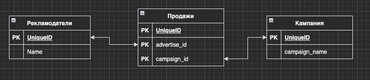
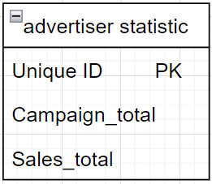
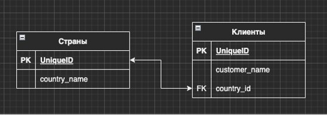
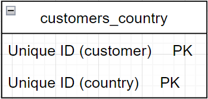
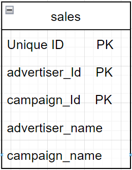

### Задание 1. 
Денормализуйте таблицу так, чтобы не нужно было для каждого рекламодателя постоянно подсчитывать количество кампаний и продаж.

Денормализуем таблицы. Добавим таблицу статистика по рекламодателям. Используем Id рекламодятеля как первичный ключ, и поля campaign_totel (количество кампаний) и sales_total (количество продаж).

Теперь можно не подсчитывать количество кампаний и продаж, а просто выгружать их из таблицы.

### Задание 2. 
В базе данных есть две таблицы: страны и клиенты. Одной из потребностей компании является исследование клиентов и стран с точки зрения эффективности продаж, поэтому часто выполняются объединения между таблицами: клиенты и страны. Что нужно сделать, чтобы ограничить частое объединение этих двух таблиц?

Денормализуем таблицы. Добавим новую таблицу, однозначно связывающую id клиента и id страны.

### Задание 3.
Вернемся к первому примеру. Предположим, компания хочет регулярно извлекать данные о продажах, например, о кампаниях или рекламодателях с полными именами. Как мы можем решить проблему постоянной необходимости
объединения таблиц?

Денормализуем таблицы. Добавим в таблицу продаж поля имени рекламодателя и кампании.

