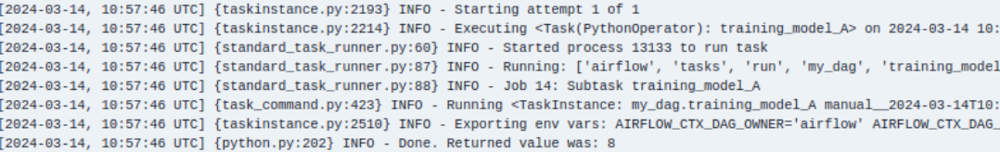

1. Скачайте файл my_first_dag.py, поместите его в папку airflow/dags. Перезапустите airflow и запустите этот dag.

2. Посмотрите логи вывода.

3. Измените этот dag так, чтобы он выводил в консоль текст «Привет + ваше имя». Посмотрите в логах, что dag выводит
то, что вы хотите.

4. Скачайте файл my_second_dag.py поместите его в папку airflow/dags.

5. Объясните, что происходит в рамках этого процесса.
В этом даге тренируются 3 модели: A, B, C. Каждая модель выдает случайное число от 1 до 10. Потом идет задача выбора модели. Если модель выдала число > 8 модель считается точной. Если все числа <=8, точных моделей нет и на выходе получаем 'неточность'.

Модель А вернула 8

модель В вернула 10

модель С вернула 6

на выходе после выбора модели получаем "accurate model"
