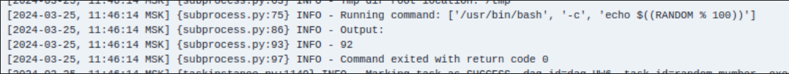
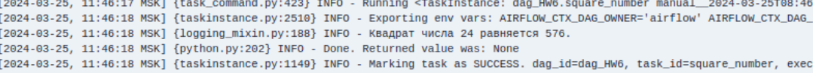
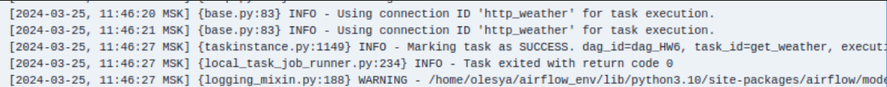
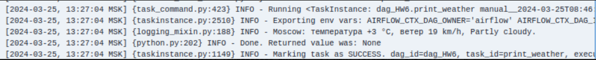
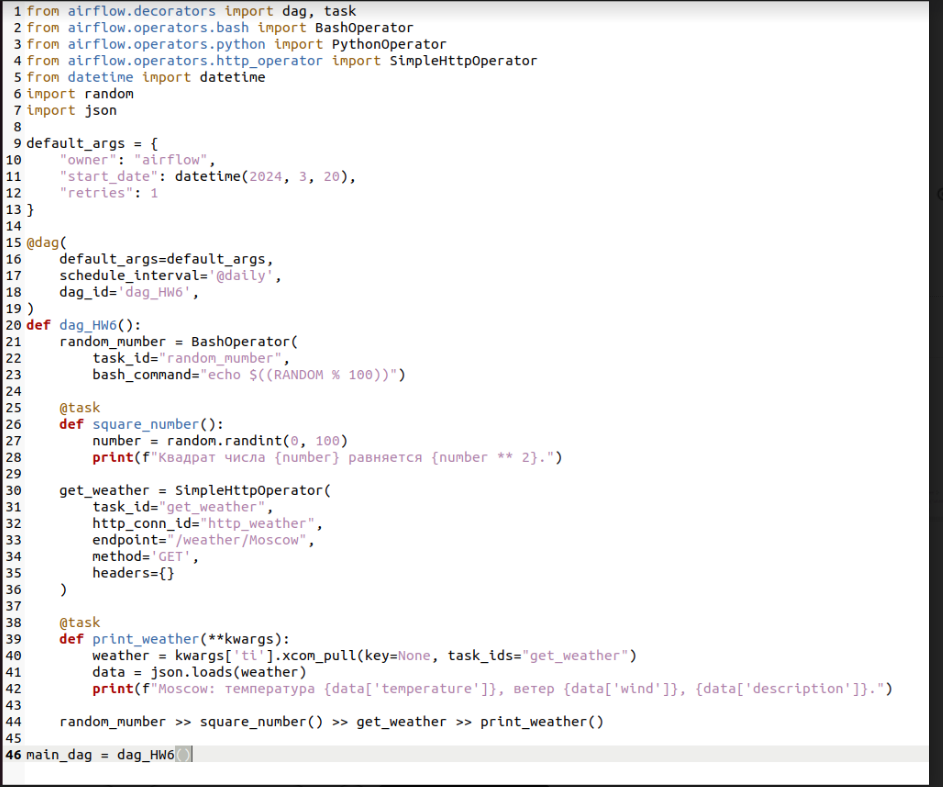
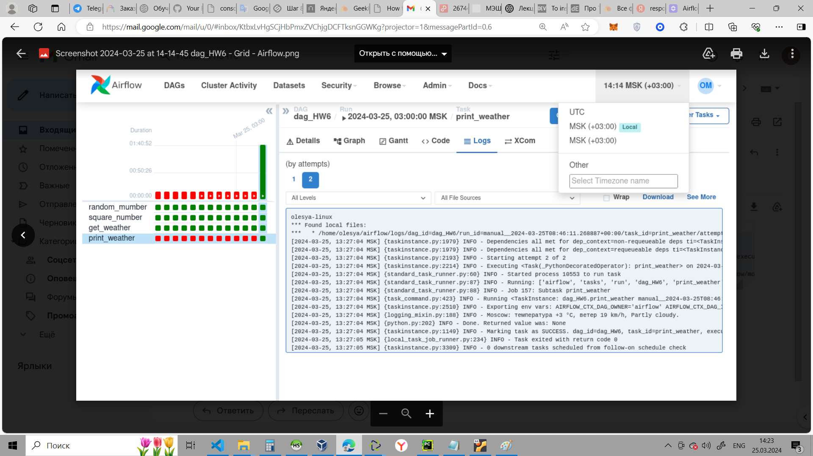

1. Создайте новый граф. Добавьте в него BashOperator, который будет генерировать рандомное число и печатать его в
консоль.

2. Создайте PythonOperator, который генерирует рандомное число, возводит его в квадрат и выводит в консоль исходное число и результат.

3. Сделайте оператор, который отправляет запрос к https://goweather.herokuapp.com/weather/"location" (вместо location используйте ваше местоположение).

4. Задайте последовательный порядок выполнения операторов.

