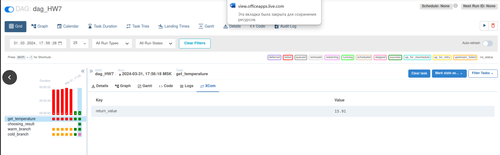
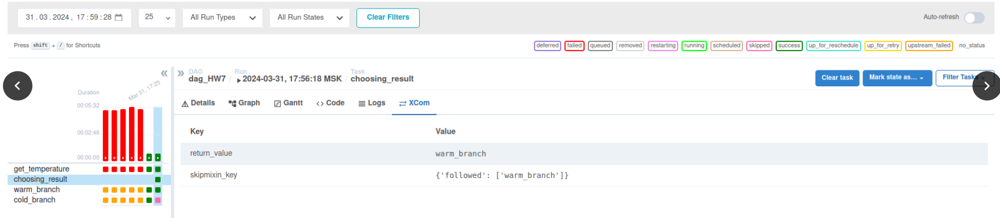
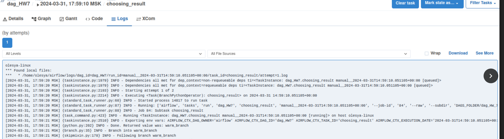
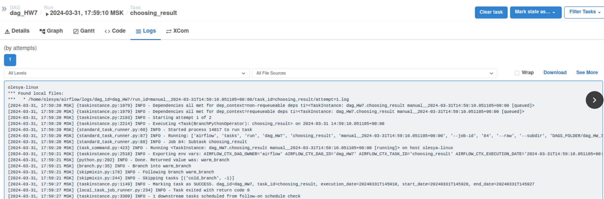
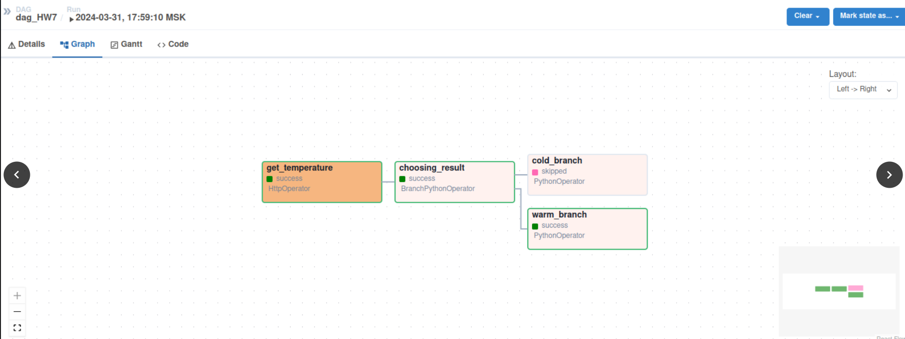
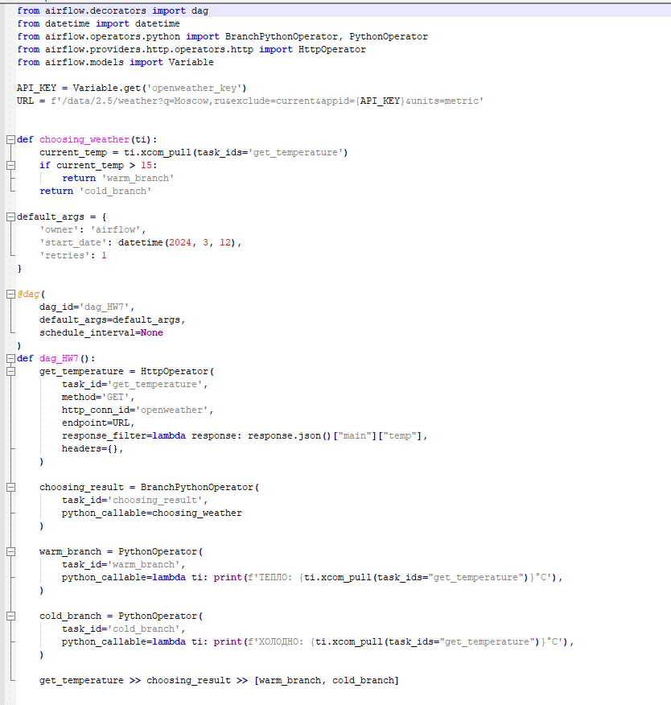

— Зарегистрируйтесь в ОрепWeatherApi (https://openweathermap.org/api)
— Создайте ETL, который получает температуру в заданной вами локации, и
дальше делает ветвление:

• В случае, если температура больше 15 градусов цельсия — идёт на ветку, в которой есть оператор, выводящий на
экран «тепло»;
• В случае, если температура ниже 15 градусов, идёт на ветку с оператором, который выводит в консоль «холодно».

Оператор ветвления должен выводить в консоль полученную от АРI температуру.

— Приложите скриншот графа и логов работы оператора ветвленния.

код дага:

