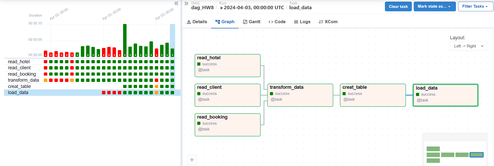
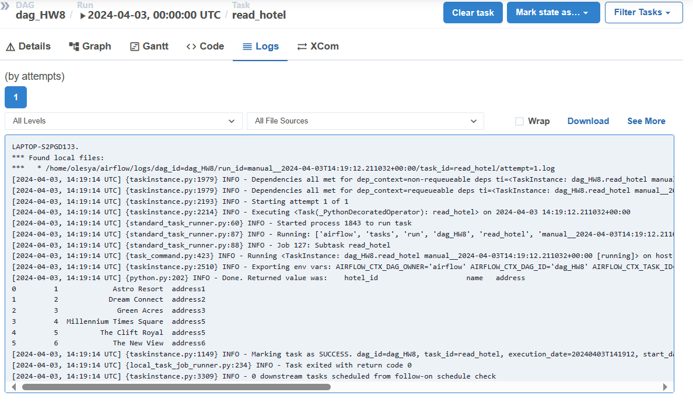
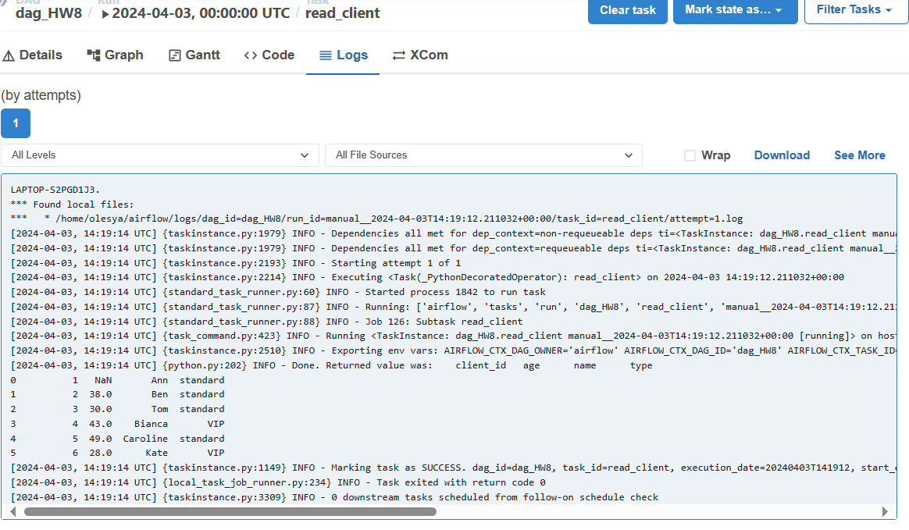
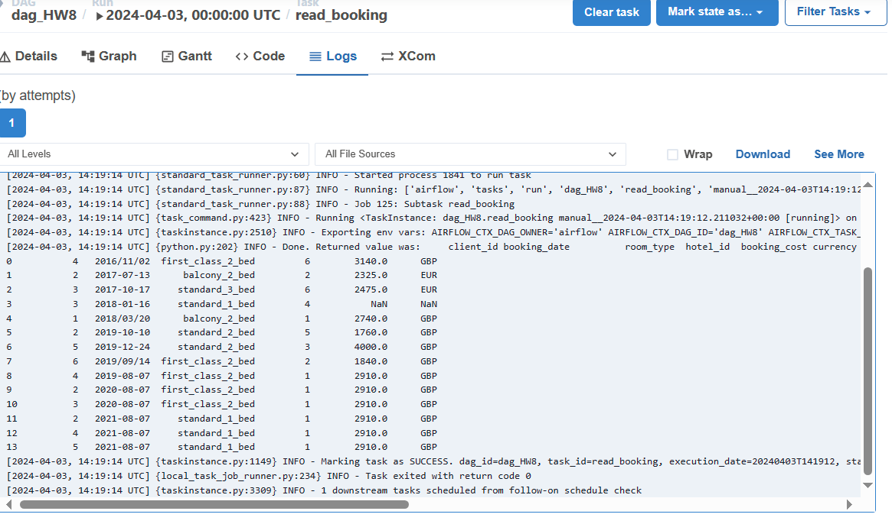
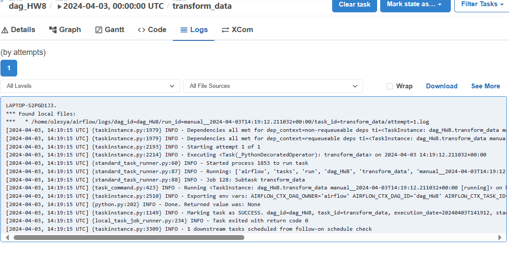
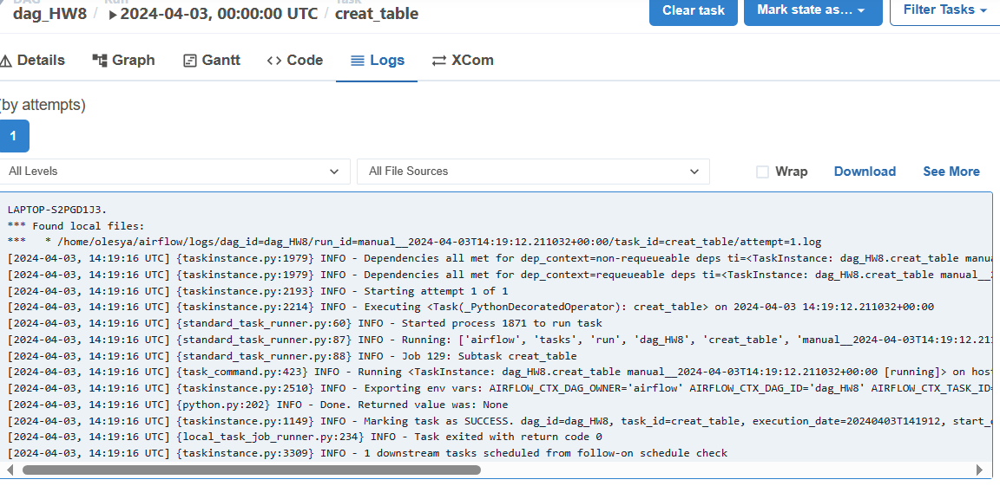
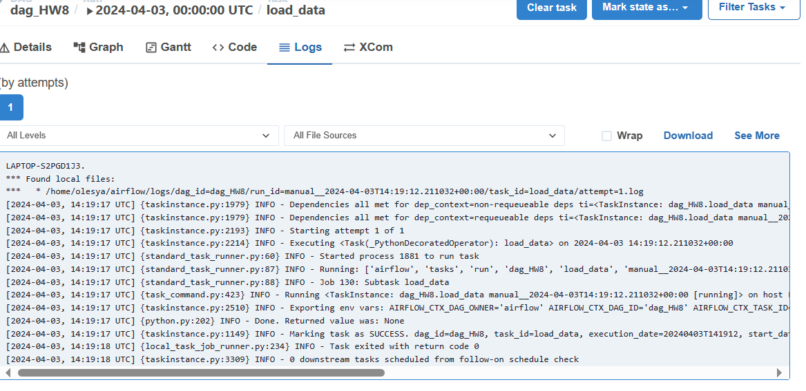
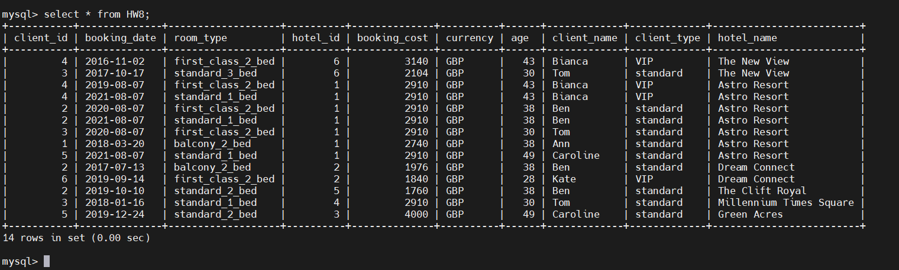
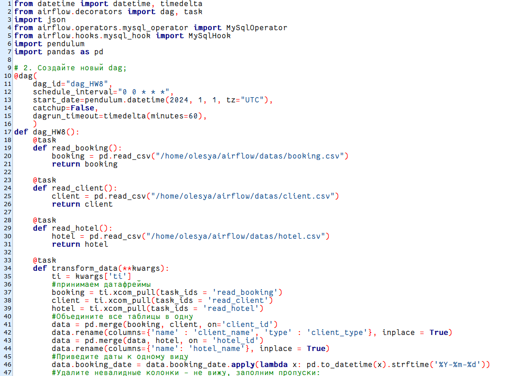
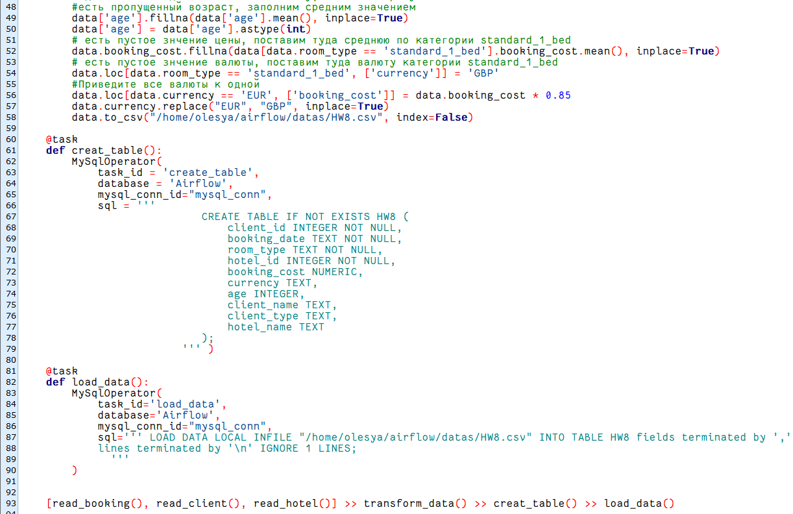

Урок 8. Специфика применения ETL в различных предметных сферах
1. Скачайте файлы boking.csv, client.csv и hotel.csv;
2. Создайте новый dag;
3. Создайте три оператора для получения данных и загрузите файлы. Передайте дата фреймы в оператор трансформации;
4. Создайте оператор который будет трансформировать данные:
— Объедините все таблицы в одну;
— Приведите даты к одному виду;
— Удалите невалидные колонки;
— Приведите все валюты к одной;
5. Создайте оператор загрузки в базу данных;
6. Запустите dag.

Граф:

Логи задач:

вывод терминала из mysql:

код:

